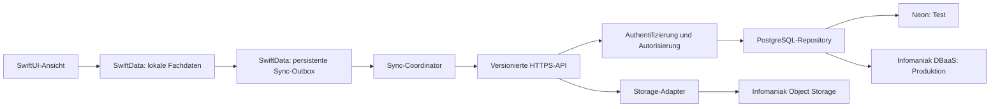

# Phase 2: Anbieterneutrale Zielarchitektur

Stand: 17. August 2026
Status: verbindliche Grundlage fuer die Umsetzung

## 1. Architekturentscheidung

Tschluessli wird **local first** umgesetzt:

1. Die App speichert eine Benutzeraenderung zuerst lokal in SwiftData.
2. In derselben lokalen Transaktion entsteht ein persistenter Sync-Auftrag.
3. Ein zentraler Sync-Coordinator uebertraegt offene Auftraege an die HTTPS-API.
4. Die API authentifiziert den Benutzer und schreibt atomar in PostgreSQL.
5. Die App bestaetigt den Auftrag erst nach einer eindeutigen Serverantwort.
6. Beim Start, nach Anmeldung, bei Netzrueckkehr und periodisch im Hintergrund
   laedt die App auch Aenderungen und Loeschungen vom Server.

Das Speichern in der App bleibt dadurch sofort und offline nutzbar. Ein Wechsel in
den Hintergrund ist lediglich ein zusaetzlicher Ausloeser und keine Voraussetzung
mehr fuer die Datensicherung.

## 2. Umgebungen

| Zweck | API | PostgreSQL | Dokumente |
| --- | --- | --- | --- |
| Lokale Entwicklung | lokaler Node-Prozess | separate Neon-Testdatenbank oder lokales PostgreSQL | lokaler Testadapter |
| Automatisierte Tests | isolierter Testprozess | kurzlebiges Testschema/isolierte Testdatenbank | In-Memory-/Testadapter |
| Test und Abnahme | Test-URL | Neon PostgreSQL | spaeter separater Test-Bucket |
| Produktion | `api.tschluessli.ch` auf Infomaniak | Infomaniak PostgreSQL DBaaS | Infomaniak Object Storage ueber Adapter |

Die Produktions-App verwendet ausschliesslich `api.tschluessli.ch`. Die App kennt
weder Neon noch Infomaniak und besitzt niemals Datenbank- oder Storage-Zugangsdaten.

## 3. Anbietergrenzen

### iPhone-App

Die App spricht eine versionierte HTTPS-JSON-API an. Die Basis-URL wird je
Build-Konfiguration gesetzt und nicht in Fachservices fest einprogrammiert.

### Backend

Die Fachlogik wird von der Hosting-Laufzeit getrennt:

- HTTP-Adapter fuer die aktuelle Vercel-Testbereitstellung.
- Standard-Node-HTTP-Adapter fuer Infomaniak.
- Gemeinsame Handler fuer Validierung, Authentifizierung und Sync.
- PostgreSQL-Repository als einzige Datenbankschnittstelle.
- Storage-Interface als einzige Schnittstelle fuer Dokumente.

### PostgreSQL

Das Backend nutzt fuer den laufenden Betrieb `DATABASE_URL` und einen kleinen,
konfigurierbaren Connection Pool. Migrationen und Sicherungen verwenden
`DATABASE_DIRECT_URL`. Beide Verbindungen muessen TLS mit Zertifikatspruefung nutzen.

Neon darf fuer die API eine gepoolte URL liefern; Migrationen verwenden dort die
direkte URL. Bei Infomaniak koennen beide Variablen auf unterschiedliche geeignete
Endpunkte oder, falls vorgesehen, auf denselben direkten PostgreSQL-Endpunkt zeigen.

Es werden nur Funktionen eingesetzt, die auf beiden PostgreSQL-Angeboten verfuegbar
und durch Integrationstests bestaetigt sind. Der aktuelle Kern benoetigt:

- Transaktionen und Fremdschluessel
- UUID, `jsonb` und `timestamptz`
- partielle Indizes
- Row-Level-Security und `set_config`/`current_setting`
- atomare Upserts mit `ON CONFLICT`

Vor der Umsetzung von RLS in Produktion wird dessen Verhalten mit der konkreten
Infomaniak-PostgreSQL-Version und den vergebenen Rollen automatisch getestet.

## 4. Verantwortlichkeiten und Datenfluss

Neon und Infomaniak stehen im Diagramm fuer getrennte Deployments. Ein einzelner
laufender API-Prozess verbindet sich immer nur mit seiner eigenen Umgebung.

## 5. Lokales Sync-Modell

Jeder geaenderte Bereich erzeugt oder aktualisiert einen Outbox-Eintrag mit:

- stabiler Auftrags-ID (UUID)
- Dossier-ID und Bereichstyp
- lokaler Schema-Version
- Art: `upsert` oder `delete`
- erwarteter Serverrevision
- Zeitpunkt der lokalen Aenderung
- Anzahl Versuche und naechster Versuch
- Zustand: `pending`, `uploading`, `blocked` oder `done`
- letzter klassifizierter Fehler

Der Payload wird beim Versand ueber einen Bereichsadapter aus dem aktuellen lokalen
Stand erzeugt. Mehrere schnelle Aenderungen desselben Bereichs werden zusammengefasst.
Ein beendeter Prozess, Flugmodus oder Neustart verliert keinen offenen Auftrag.

## 6. Einheitliche Bereichsadapter

Jeder synchronisierte Bereich implementiert denselben Vertrag:

- stabiler `sectionType`
- aktuelle `schemaVersion`
- Export lokaler Modelle in ein JSON-Objekt
- Validierung und Import eines JSON-Objekts
- Migration aelterer Payload-Versionen
- Auflistung sensibler Felder, die vor dem Upload verschluesselt werden

Die Sync-Engine kennt dadurch keine einzelnen Masken oder Datenfelder. Neue Felder
erfordern normalerweise nur eine neue Schema-Version und eine Abwaertsmigration im
betroffenen Adapter, nicht den erneuten Bau der gesamten Synchronisation.

## 7. API-Vertrag v1

Alle Antworten enthalten eine Request-ID. Veraendernde Anfragen tragen eine
Idempotency-ID, damit Wiederholungen denselben Effekt haben.

Geplante Kernoperationen:

- Konto erstellen, anmelden, Sitzung erneuern und abmelden
- Dossier-Metadaten laden
- alle seit einem Cursor geaenderten Bereiche und Loeschungen laden
- einen oder mehrere Bereiche idempotent hochladen
- Bereich logisch loeschen (Tombstone)
- Geraet registrieren bzw. widerrufen

Der Server prueft Authentifizierung, Dossierzugriff, Schema-Version, Payload-Groesse
und erwartete Revision. Konflikte liefern den aktuellen Serverstand oder einen
Download-Cursor; sie werden nicht als unspezifischer Fehler behandelt.

## 8. Konfliktregel

- Normalfall: Optimistic Concurrency ueber eine monoton steigende Serverrevision.
- Unterschiedliche Bereiche koennen unabhaengig synchronisieren.
- Bei gleicher Ausgangsrevision wird die Aenderung atomar angenommen.
- Bei abweichender Revision wird nichts ueberschrieben.
- Der Client laedt den aktuellen Bereich und fuehrt eine definierte Adapterstrategie
  aus: sichere Feldzusammenfuehrung oder sichtbarer Benutzerentscheid.
- Loeschungen werden als Tombstones mit Revision synchronisiert, bis alle relevanten
  Geraete sie gesehen haben.

Ein pauschales "letztes Schreiben gewinnt" wird fuer Vorsorge- und Zugangsdaten nicht
verwendet, weil es unbemerkt Informationen vernichten koennte.

## 9. Sicherheitsgrenzen

- Das Kontopasswort wird nur zur Anmeldung uebertragen und niemals lokal gespeichert.
- Der Server speichert ausschliesslich einen gesalzenen Passwort-Hash.
- Kurzlebige Access Tokens und erneuerbare Sitzungen liegen im iOS-Keychain.
- Normale strukturierte Daten liegen mit iOS Data Protection in SwiftData und mit
  Zugriffskontrolle in PostgreSQL.
- Passwoerter, PINs und vergleichbare Geheimnisse aus Dossierbereichen werden vor
  dem Upload auf dem Endgeraet mit AES-256-GCM verschluesselt.
- Der dazugehoerige Dossier-Schluessel wird getrennt verwaltet und erhaelt einen
  Wiederherstellungsweg fuer Neuinstallation und Zweitgeraet.
- Logs enthalten keine Payloads, Passwoerter, Tokens oder Entschluesselungsschluessel.
- Secrets werden pro Umgebung getrennt und nur serverseitig verwaltet.

Die konkrete Keychain-, Data-Protection- und Recovery-Umsetzung erfolgt in den
dafuer vorgesehenen Sicherheitsphasen.

## 10. Migrationen

- Unveraenderliche, aufsteigend nummerierte SQL-Dateien.
- Tabelle `schema_migrations` protokolliert jede ausgefuehrte Migration mit Pruefsumme.
- Ein einzelner Migration-Runner verwendet `DATABASE_DIRECT_URL`.
- Keine automatische Schemaaenderung beim Start eines API-Prozesses.
- Ablauf: Backup -> Neon -> Integrationstests -> Infomaniak Staging -> Backup/Restore-
  Nachweis -> Produktion.
- Rueckwaertskompatible Erweiterungen werden vor App-Releases bereitgestellt.
- Zerstoerende Bereinigungen erfolgen erst, wenn keine alte App-Version sie benoetigt.

## 11. Konfigurationsvertrag

Das Backend erhaelt mindestens:

| Variable | Zweck |
| --- | --- |
| `APP_ENV` | `development`, `test`, `staging` oder `production` |
| `DATABASE_URL` | Laufende PostgreSQL-Verbindung |
| `DATABASE_DIRECT_URL` | Migrationen und Sicherungen |
| `DATABASE_POOL_MAX` | Anbieter- und Laufzeitgerechte Poolgroesse |
| `DATABASE_SSL_MODE` | In Cloudumgebungen zwingend `verify-full`/gleichwertig |
| `SESSION_SECRET` | Umgebungsspezifische Sitzungsabsicherung |
| `EMAIL_VERIFICATION_SECRET` | Signatur der E-Mail-Bestaetigung |
| `STORAGE_DRIVER` | `local`, `test` oder spaeter `infomaniak` |

Bestehende Variablennamen werden in einer spaeteren Implementierungsphase kontrolliert
migriert. Es werden keine produktiven Geheimnisse in Git gespeichert.

## 12. Betrieb und Freigabe

- Strukturierte Logs mit Request-ID, Umgebung, Dauer und Fehlerklasse.
- Health-Endpunkte fuer Prozess und Datenbankbereitschaft.
- Metriken fuer Fehlerrate, Latenz, offene/fehlgeschlagene Syncs und Poolauslastung.
- Verschluesselte, automatisierte PostgreSQL- und Object-Storage-Backups.
- Regelmaessiger, dokumentierter Restore-Test in einer isolierten Umgebung.
- Produktionsfreigabe erst nach identischen Vertragstests gegen Neon und Infomaniak.

## 13. Nicht Bestandteil dieser Phase

Phase 2 legt die Architektur fest, veraendert aber noch keine App-Daten, Tabellen,
Cloudvariablen oder Deployments. Der vorhandene serielle Hintergrund-Prototyp bleibt
bis zur kontrollierten Ablösung nachvollziehbar im Git-Verlauf.

## 14. Abnahmekriterien Phase 2

- [x] Neon ist als Test- und Infomaniak PostgreSQL DBaaS als Produktionsdatenbank definiert.
- [x] Die App ist von Datenbank- und Hostinganbietern entkoppelt.
- [x] Local-first, persistente Outbox und bidirektionaler Sync sind festgelegt.
- [x] Konflikte, Loeschungen und Schema-Versionen besitzen eine einheitliche Strategie.
- [x] Kontopasswoerter und Dossier-Geheimnisse haben getrennte Sicherheitsgrenzen.
- [x] Migration, Backup, Restore, Monitoring und Freigabereihenfolge sind definiert.
- [x] Der Wechsel von Neon zu Infomaniak erfolgt durch Deployment-Konfiguration und
  dieselben getesteten Migrationen, nicht durch eine zweite Implementierung.

## 15. Gepruefte Anbietergrundlagen

- Infomaniak beschreibt sein DBaaS als verwaltete, hochverfuegbare Datenbankloesung
  in der Schweiz mit PostgreSQL-Unterstuetzung:
  <https://www.infomaniak.com/de/support/faq/418/verwenden-von-dbms-mysql-bibliotheken-etc>
- Die Infomaniak Public-Cloud-API liefert fuer DBaaS eigene Verbindungsinformationen
  einschliesslich Host, Port, Benutzer, URI und CA:
  <https://developer.infomaniak.com/docs/api/post/1/public_clouds/%7Bpublic_cloud_id%7D/projects/%7Bpublic_cloud_project_id%7D/dbaas/%7Bdbaas_id%7D/reset_password>
- Neon empfiehlt fuer Migrationen und `pg_dump` eine direkte statt einer gepoolten
  Verbindung:
  <https://neon.com/docs/connect/connection-pooling>

Die Umsetzung der lokalen Sicherheitsgrundlage ist in
[`phase-3-local-security.md`](phase-3-local-security.md) festgehalten.
